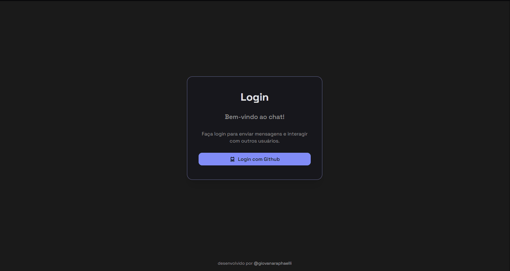

# Chat App

Aplicação de chat em tempo real desenvolvida com Next.js e Supabase Realtime.

<h4 align="center"><a target="_blank" href="https://chat-app.giovanaraphaelli.tech">Clique para visitar o projeto</a></h4>

## ✨ Funcionalidades

- **Mensagens em tempo real**: Envio e recebimento instantâneos de mensagens.
- **Autenticação via Github**: Integração com Supabase Auth.
- **Armazenamento Persistente**: Mensagens armazenadas no PostgreSQL via Supabase.
- **Editar e excluir mensagens**: Permite modificar ou remover mensagens enviadas.
- **Visualizar usuários online**: Indica quais usuários estão ativos no chat.
- **Notificação de nova mensagem**: Alerta para novas mensagens recebidas.
- **Paginação**: Carregamento eficiente de histórico de mensagens.

## 📚 Aprendizados

Durante o desenvolvimento deste projeto, pude explorar alguns conceitos:

- **Autenticação com Supabase Auth**: Configuração de login/logout e gestão de sessões de usuários.
- **Integração com Supabase Realtime**: Implementação de mensagens instantâneas sem necessidade de recarregar a página.
- **Gerenciamento de estado com Zustand**: Utilização do Zustand para gerenciar estados globais de forma eficiente.
- **Manipulação de banco de dados**: Uso de PostgreSQL via Supabase para armazenar e recuperar mensagens.
- **Experiência do usuário**: Implementação de notificações em tempo real e troca de tema para melhor usabilidade.

## 🚀 Tecnologias Utilizadas

- **Next.js**: Framework React para aplicações modernas com SSR e SSG.
- **TypeScript**: Superset do JavaScript com tipagem estática.
- **Supabase**: Plataforma backend baseada em PostgreSQL com Realtime e Auth.
- **Zustand**: Biblioteca de gerenciamento de estado simples e performática.
- **Tailwind CSS**: Framework CSS utilitário para estilização eficiente.
- **ShadCN UI**: Conjunto de componentes estilizados e acessíveis, integrando Radix e Tailwind.
